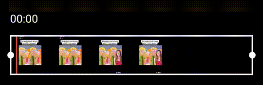
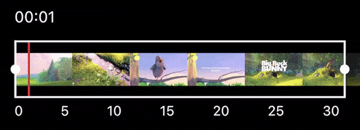
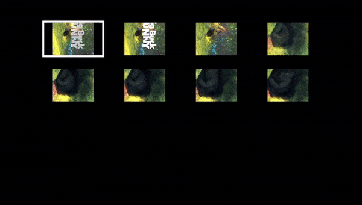

# video_editor

<br>

## My other APIs

- [Scroll Navigation](https://pub.dev/packages/scroll_navigation)
- [Video Viewer](https://pub.dev/packages/video_viewer)
- [Helpers](https://pub.dev/packages/helpers)

<br>

## Features

- Super flexible UI Design.
- Support actions:
  - Crop
  - Trim
  - Scale
  - Rotate
  - Cover selection

<br><br>

## **Installation** (More info on [Flutter FFMPEG](https://pub.dev/packages/flutter_ffmpeg))

### **Android**

Add on `android/build.gradle` file and define package name in `ext.flutterFFmpegPackage` variable.

```gradle
ext.flutterFFmpegPackage = "min-gpl-lts"
```

### **iOS**

### (Flutter >= 2.x)

- Edit `ios/Podfile`, add the following block **before** `target 'Runner do` and specify the package name in `min-gpl-lts` section:

  ```python
    # "fork" of method flutter_install_plugin_pods (in fluttertools podhelpers.rb) to get lts version of ffmpeg
    def flutter_install_plugin_pods(application_path = nil, relative_symlink_dir, platform)
      # defined_in_file is set by CocoaPods and is a Pathname to the Podfile.
      application_path ||= File.dirname(defined_in_file.realpath) if self.respond_to?(:defined_in_file)
      raise 'Could not find application path' unless application_path

      # Prepare symlinks folder. We use symlinks to avoid having Podfile.lock
      # referring to absolute paths on developers' machines.

      symlink_dir = File.expand_path(relative_symlink_dir, application_path)
      system('rm', '-rf', symlink_dir) # Avoid the complication of dependencies like FileUtils.

      symlink_plugins_dir = File.expand_path('plugins', symlink_dir)
      system('mkdir', '-p', symlink_plugins_dir)

      plugins_file = File.join(application_path, '..', '.flutter-plugins-dependencies')
      plugin_pods = flutter_parse_plugins_file(plugins_file, platform)
      plugin_pods.each do |plugin_hash|
        plugin_name = plugin_hash['name']
        plugin_path = plugin_hash['path']
        if (plugin_name && plugin_path)
          symlink = File.join(symlink_plugins_dir, plugin_name)
          File.symlink(plugin_path, symlink)

          if plugin_name == 'flutter_ffmpeg'
            pod 'flutter_ffmpeg/<package name>', :path => File.join(relative_symlink_dir, 'plugins', plugin_name, platform)
          else
            pod plugin_name, :path => File.join(relative_symlink_dir, 'plugins', plugin_name, platform)
          end
        end
      end
    end
  ```

### (Flutter >= 1.20.x) && (Flutter < 2.x)

- Edit `ios/Podfile`, add the following block **before** `target 'Runner do` and specify the package name in `min-gpl-lts` section:

  ```python
    # "fork" of method flutter_install_ios_plugin_pods (in fluttertools podhelpers.rb) to get lts version of ffmpeg
    def flutter_install_ios_plugin_pods(ios_application_path = nil)
     # defined_in_file is set by CocoaPods and is a Pathname to the Podfile.
      ios_application_path ||= File.dirname(defined_in_file.realpath) if self.respond_to?(:defined_in_file)
      raise 'Could not find iOS application path' unless ios_application_path

      # Prepare symlinks folder. We use symlinks to avoid having Podfile.lock
      # referring to absolute paths on developers' machines.

      symlink_dir = File.expand_path('.symlinks', ios_application_path)
      system('rm', '-rf', symlink_dir) # Avoid the complication of dependencies like FileUtils.

      symlink_plugins_dir = File.expand_path('plugins', symlink_dir)
      system('mkdir', '-p', symlink_plugins_dir)

      plugins_file = File.join(ios_application_path, '..', '.flutter-plugins-dependencies')
      plugin_pods = flutter_parse_plugins_file(plugins_file)
      plugin_pods.each do |plugin_hash|
        plugin_name = plugin_hash['name']
        plugin_path = plugin_hash['path']

        if (plugin_name && plugin_path)
            symlink = File.join(symlink_plugins_dir, plugin_name)
            File.symlink(plugin_path, symlink)

            if plugin_name == 'flutter_ffmpeg'
                pod plugin_name + '/min-gpl-lts', :path => File.join('.symlinks', 'plugins', plugin_name, 'ios')
            else
                pod plugin_name, :path => File.join('.symlinks', 'plugins', plugin_name, 'ios')
            end
        end
      end
    end
  ```

- Ensure that `flutter_install_all_ios_pods File.dirname(File.realpath(__FILE__))` function is called within
  `target 'Runner' do` block. In that case, it is mandatory that the added function is named
  `flutter_install_ios_plugin_pods` and that you **do not** make an explicit call within that block.

### (Flutter < 1.20.x)

- Edit `ios/Podfile` file and modify the default `# Plugin Pods` block as follows. Do not forget to specify the package
  name in `min-gpl-lts` section.

  ```python
    # Prepare symlinks folder. We use symlinks to avoid having Podfile.lock
    # referring to absolute paths on developers' machines.
    system('rm -rf .symlinks')
    system('mkdir -p .symlinks/plugins')
    plugin_pods = parse_KV_file('../.flutter-plugins')
    plugin_pods.each do |name, path|
        symlink = File.join('.symlinks', 'plugins', name)
        File.symlink(path, symlink)
        if name == 'flutter_ffmpeg'
            pod name+'/min-gpl-lts', :path => File.join(symlink, 'ios')
        else
            pod name, :path => File.join(symlink, 'ios')
        end
    end
  ```

<br><br>

## **Example** (The UI Design is fully customizable on the [example](https://pub.dev/packages/video_editor/example))

- Dependencies used:
  - [Helpers](https://pub.dev/packages/helpers)
  - [Image Picker](https://pub.dev/packages/image_picker)

<br>

| Crop Video                          | Rotate Video                          |
| ----------------------------------- | ------------------------------------- |
|  |  |

<br>

| Trim Video                          | Export Video                          |
| ----------------------------------- | ------------------------------------- |
|  |  |

| Trimmer if maxDuration < videoDuration  | Trim timeline                           |
| --------------------------------------- |  -------------------------------------- |
|  |   |

| Video cover (selection, viewer)       | Export cover                          |
| ------------------------------------- | ------------------------------------- |
|  |  |
