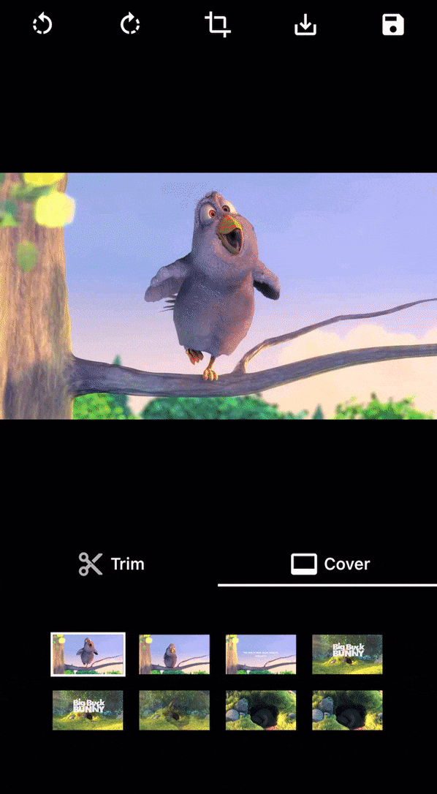
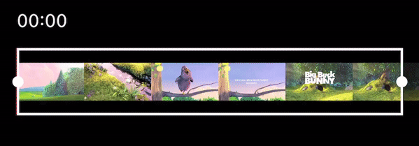

# Flutter video editor

[](https://flutter.io)
[](https://pub.dev/packages/video_editor)

A video editor that allows to edit (trim, crop, rotate and scale) and choose a cover with a very flexible UI design.
The changes are then exported with `ffmpeg`.

## 📖 Installation

Following steps will help you add this library as a dependency in your flutter project.

- In the `pubspec.yaml` file in the root of your project

```yaml
dependencies:
  video_editor: ^1.4.3
```

- Run the following command to install the package:

```bash
$ flutter packages get
```

- Import the package in your project file:

```dart
import 'package:video_editor/video_editor.dart';
```

Since [v1.3.0](https://github.com/seel-channel/video_editor/releases/tag/v1.3.0), video_editor uses ffmpeg_kit_flutter main release which supports the latest features. (More info on [flutter FFmepeg kit](https://github.com/tanersener/ffmpeg-kit/tree/main/flutter/flutter))

Those Android API level and iOS deployment target are required to uses this package. If you're planing to target older devices, check about the [LTS release](#1-how-to-use-ffmpeg-lts-release).

<table>
<thead>
<tr>
<th align="center">Android<br>API Level</th>
<th align="center">iOS Minimum<br>Deployment Target</th>
</tr>
</thead>
<tbody>
<tr>
<td align="center">24</td>
<td align="center">12.1</td>
</tr>
</tbody>
</table>

## 📸 Screenshots
(The UI Design is fully customizable on the [example](https://pub.dev/packages/video_editor/example))

| Crop Video                          | Rotate Video                          | Video cover (selection, viewer)       |
| ----------------------------------- | ------------------------------------- | ------------------------------------- |
|  |  |  |

| Trim video                              | Trimmer customization                       |
| --------------------------------------- |  ------------------------------------------ |
|  |   |

## 👀 Usage

### VideoEditorController

| Function                         | Description                       |
| -------------------------------- | --------------------------------- |
| initialize()                     | Init the `controller` parameters, the video, the trim and the cover |
| rotate90Degrees(RotateDirection) | Rotate the video by 90 degrees in the direction provided            |
| preferredCropAspectRatio         | Update the aspect ratio of the crop area                            |
| updateCrop                       | Update the controller crop min and max values                       |
| getMetaData(onCompleted)         | Return the metadata of the video file in `onCompleted` function     |
| exportVideo(onCompleted)         | Return the generated video with the controller parameters in `onCompleted` function |
| extractCover(onCompleted)        | Return the selected cover with the controller parameters in `onCompleted` function  |

### Widgets

<details>
  <summary>Click to expand widgets documentation</summary>

####  Crop
##### 1. CropGridViewer

This widget is used to enable the crop actions on top of the video, or only to preview the cropped result.

| Param                            | Description                       |
| -------------------------------- | --------------------------------- |
| required VideoEditorController controller | The `controller` param is mandatory so every change in the controller settings will propagate in the crop view |
| bool showGrid = true | The `showGrid` param specifies whether the crop action can be triggered and if the crop grid is shown, set this param to `false` to display the preview of the cropped video |
| double horizontalMargin = 0.0 | The `horizontalMargin` param need to be specify when there is a margin outside the crop view, so in case of a change the new layout can be computed properly (i.e after a rotation) |

#### Trimmer

##### 1. TrimSlider

Display the trimmer containing video thumbnails with rotation and crop parameters.

| Param                            | Description                       |
| -------------------------------- | --------------------------------- |
| required VideoEditorController controller | The `controller` param is mandatory so every change in the controller settings will propagate in the trim slider view |
| double height = 0.0 | The `height` param specifies the height of the generated thumbnails |
| double quality = 10 | The `quality` param specifies the quality of the generated thumbnails, from 0 to 100 ([more info](https://pub.dev/packages/video_thumbnail)) |
| double horizontalMargin = 0.0 | The `horizontalMargin` param specifies the horizontal space to set around the slider. It is important when the trim can be dragged (`controller.maxDuration` < `controller.videoDuration`) |
| Widget? child | The `child` param can be specify to display a widget below this one (e.g: TrimTimeline) |

##### 2. TrimTimeline

Display the video timeline.

| Param                            | Description                       |
| -------------------------------- | --------------------------------- |
| required VideoEditorController controller | The `controller` param is mandatory so depending on the `controller.maxDuration`, the generated timeline will be different |
| double secondGap = 5 | The `secondGap` param specifies time gap in second between every points of the timeline |
| EdgeInsets margin = EdgeInsets.zero | The `margin` param specifies the space surrounding the timeline |

#### Cover
##### 1. CoverSelection

Display a couple of generated covers with rotation and crop parameters to updated the selected cover.

| Param                            | Description                       |
| -------------------------------- | --------------------------------- |
| required VideoEditorController controller | The `controller` param is mandatory so every change in the controller settings will propagate in the cover selection view |
| double height = 0.0 | The `height` param specifies the height of the generated thumbnails |
| double quality = 10 | The `quality` param specifies the quality of the generated thumbnails, from 0 to 100 ([more info](https://pub.dev/packages/video_thumbnail)) |
| double horizontalMargin = 0.0 | The `horizontalMargin` param need to be specify when there is a margin outside the crop view, so in case of a change the new layout can be computed properly. |
| int quantity = 5 | The `quantity` param specifies the quantity of thumbnails to generate |

##### 2. CoverViewer

Display the selected cover with rotation and crop parameters.

| Param                            | Description                       |
| -------------------------------- | --------------------------------- |
| required VideoEditorController controller | The `controller` param is mandatory so every change in the controller settings will propagate the crop parameters in the cover view |
| String noCoverText = 'No selection' | The `noCoverText` param specifies the text to display when selectedCover is `null` |

</details>

### Style

<details>
  <summary>Click to expand style documentation</summary>

#### 1. CropStyle

You can create your own CropStyle class to customize the CropGridViewer appareance.

| Param                            | Description                       |
| -------------------------------- | --------------------------------- |
| Color croppingBackground = Colors.black.withOpacity(0.48) | The `croppingBackground` param specifies the color of the paint area outside the crop area when copping |
| Color background = Colors.black | The `background` param specifies the color of the paint area outside the crop area when not copping |
| double gridLineWidth = 1 | The `gridLineWidth` param specifies the width of the crop lines |
| Color gridLineColor = Colors.white | The `gridLineColor` param specifies the color of the crop lines |
| int gridSize = 3 | The `gridSize` param specifies the quantity of columns and rows in the crop view |
| Color boundariesColor = Colors.white | The `boundariesColor` param specifies the color of the crop area's corner |
| double boundariesLength = 20 | The `boundariesLength` param specifies the length of the crop area's corner |
| double boundariesWidth = 5 | The `boundariesWidth` param specifies the width of the crop area's corner |

#### 2. TrimStyle

You can create your own TrimStyle class to customize the TrimSlider appareance.

| Param                            | Description                       |
| -------------------------------- | --------------------------------- |
| Color background = Colors.black.withOpacity(0.6) | The `background` param specifies the color of the paint area outside the trimmed area |
| Color positionLineColor = Colors.red | The `positionLineColor` param specifies the color of the line showing the video position |
| double positionLineWidth = 2 | The `positionLineWidth` param specifies the width  of the line showing the video position |
| Color lineColor = Colors.white | The `lineColor` param specifies the color of the borders around the trimmed area |
| double lineWidth = 2 | The `lineWidth` param specifies the width of the borders around the trimmed area |
| Color iconColor = Colors.black | The `iconColor` param specifies the color of the icons on the trimmed area's edges |
| double circleSize = 8 | The `circleSize` param specifies the size of the circle behind the icons on the trimmed area's edges |
| double iconSize = 25 | The `iconSize` param specifies the size of the icon on the trimmed area's edges |
| IconData? leftIcon = Icons.arrow_left | The `leftIcon` param specifies the icon to show on the left edge of the trimmed area |
| IconData? rightIcon = Icons.arrow_right | The `rightIcon` param specifies the icon to show on the right edge of the trimmed area |

#### 3. CoverStyle

You can create your own CoverStyle class to customize the CoverSelection appareance.

| Param                            | Description                       |
| -------------------------------- | --------------------------------- |
| Color selectedBorderColor = Colors.white | The `selectedBorderColor` param specifies the color of the border around the selected cover thumbnail |
| double selectedBorderWidth = 2 | The `selectedBorderWidth` param specifies the width of the border around the selected cover thumbnail |
| Widget? selectedIndicator | The `selectedIndicator` param specifies the `Widget` to show on top of the selected cover |
| AlignmentGeometry selectedIndicatorAlign = Alignment.bottomRight | The `selectedIndicatorAlign` param specifies where `selectedIndicator` should be shown in the `Stack` |

</details>

## FAQ

### 1. How to use FFmpeg LTS release

Since [v1.3.0](https://github.com/seel-channel/video_editor/releases/tag/v1.3.0), video_editor uses ffmpeg_kit_flutter main release which supports the latest features. If you want to support a wider range of devices you should use the LTS release. [more info](https://github.com/tanersener/ffmpeg-kit#10-lts-releases)


To do this, add this to your `pubspec.yaml`:
```yaml
dependency_overrides:
  ffmpeg_kit_flutter_min_gpl: ^4.5.1-LTS
```

## ✨ Main contributors

<table>
  <tr>
    <td align="center"><a href="https://github.com/LeGoffMael"><br/><sub><b>Le Goff Maël</b></sub></a></td>
  </tr>
</table>
<br/>
