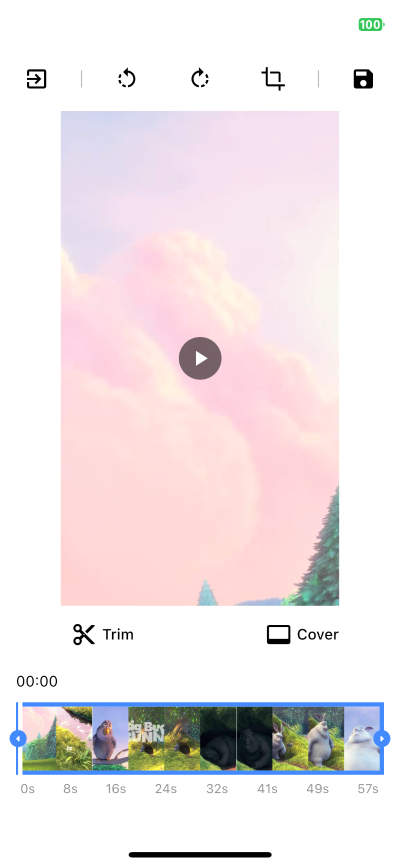

# Flutter video editor

[](https://pub.dev/packages/video_editor)
[](https://github.com/LeGoffMael/video_editor/stargazers)

A video editor that allows to edit (trim, crop, rotate and scale) and choose a cover with a very flexible UI design.

The library provides some tools to execute the exportation but does not handle it.

This library is written in Dart only but uses external packages such as [video_thumbnail](https://pub.dev/packages/video_thumbnail), which makes it available only on iOS and Android plaforms for now ([web support is currently in progress](https://github.com/LeGoffMael/video_editor/pull/147)).

> **Note**
> If you use a version between (1.2.3 and 2.4.0) your project might be subject to a GPL license.

|             | Android | iOS   |
|-------------|---------|-------|
| **Support** | SDK 16+ | 11.0+ |

## 📖 Installation

Following steps will help you add this library as a dependency in your flutter project.

- Run `flutter pub add video_editor`, or add video_editor to `pubspec.yaml` file manually.

```yaml
dependencies:
  video_editor: ^2.4.0
```

- Import the package in your code:

```dart
import 'package:video_editor/video_editor.dart';
```

## 📸 Screenshots

| Example app running on an Iphone 11 pro | Customization example, light mode |
| --------------------------------------- | --------------------------------- |
|                   |     |

## 👀 Usage

```dart
final VideoEditorController _controller = VideoEditorController.file(
  File('/path/to/video.mp4'),
  minDuration: const Duration(seconds: 1),
  maxDuration: const Duration(seconds: 10),
);

@override
void initState() {
  super.initState();
  _controller.initialize().then((_) => setState(() {}));
}

@override
void dispose() {
  _controller.dispose();
  super.dispose();
}

/// Basic export video function
Future<void> exportVideo() async {
  final config = VideoFFmpegVideoEditorConfig(_controller);
  // Returns the generated command and the output path
  final FFmpegVideoEditorExecute execute = await config.getExecuteConfig();

  // ... handle the video exportation yourself, using ffmpeg_kit_flutter, your own video server, ...
}

/// Export the video as a GIF image
Future<void> exportGif() async {
  final gifConfig = VideoFFmpegVideoEditorConfig(
    _controller,
    format: VideoExportFormat.gif,
  );
  // Returns the generated command and the output path
  final FFmpegVideoEditorExecute gifExecute = await gifConfig.getExecuteConfig();

  // ...
}

/// Export a video, with custom command (ultrafast preset + horizontal flip)
Future<void> exportMirroredVideo() async {
  final mirrorConfig = VideoFFmpegVideoEditorConfig(
      _controller,
      name: 'mirror-video'
      commandBuilder: (VideoFFmpegVideoEditorConfig config, String videoPath, String outputPath) {
        final List<String> filters = config.getExportFilters();
        filters.add('hflip'); // add horizontal flip

        return '-i $videoPath ${config.filtersCmd(filters)} -preset ultrafast $outputPath';
      },
    );
  // Returns the generated command and the output path
  final FFmpegVideoEditorExecute mirrorExecute = await mirrorConfig.getExecuteConfig();

  // ...
}
```

For more details check out the [example](https://github.com/LeGoffMael/video_editor/tree/master/example).

### VideoEditorController

| Function                         | Description                       |
| -------------------------------- | --------------------------------- |
| initialize(double? aspectRatio)  | Init the `controller` parameters, the video, the trim and the cover, call `cropAspectRatio` |
| rotate90Degrees(RotateDirection) | Rotate the video by 90 degrees in the direction provided            |
| setPreferredRatioFromCrop        | Update the aspect ratio to the current crop area ratio              |
| cropAspectRatio(double?)         | Update the aspect ratio + update the crop area to the center of the video size |
| updateCrop(Offset, Offset)       | Update the controller crop min and max values                       |
| applyCacheCrop                   | Update the controller crop min and max values with cache values     |
| updateTrim(double, double)       | Update the controller trim min and max values                       |

| Getter                           | Description                       |
| -------------------------------- | --------------------------------- |
| Duration startTrim               | The start value of the trimmed area |
| Duration endTrim                 | The end value of the trimmed area |
| Duration trimmedDuration         | The duration of the selected trimmed area |
| bool isTrimmed                   | Set to `true` when the trimmed values are not the default video duration |
| bool isTrimming                  | Set to `true` when startTrim or endTrim is changing |
| Duration maxDuration             | The maxDuration possible for the trimmed area |
| Duration minDuration             | The minDuration possible for the trimmed area |
| Offset minCrop                   | The top left position of the crop area (between `0.0` and `1.0`) |
| Offset maxCrop                   | The bottom right position of the crop area (between `0.0` and `1.0`) |
| Size croppedArea                 | The actual Size of the crop area |
| double? preferredCropAspectRatio | The preferred crop aspect ratio selected |
| bool isRotated                   | Set to `true` when the rotation is different to `0` |
| int rotation                     | The rotation angle set `0`, `90`, `180` and `270` |
| int cacheRotation                | The sum of all the rotation applied in the editor |
| CoverData? selectedCoverVal      | The selected cover thumbnail that will be used to export the final cover |
| int coverThumbnailsQuality = 10  | The `coverThumbnailsQuality` param specifies the quality of the generated cover thumbnails, from 0 to 100 ([more info](https://pub.dev/packages/video_thumbnail)) |
| int trimThumbnailsQuality = 10   | The `trimThumbnailsQuality` param specifies the quality of the generated trim slider thumbnails, from 0 to 100 ([more info](https://pub.dev/packages/video_thumbnail)) |


### Widgets

<details>
  <summary>Click to expand widgets documentation</summary>

####  Crop
##### 1. CropGridViewer

This widget is used to enable the crop actions on top of the video (CropGridViewer.edit), or only to preview the cropped result (CropGridViewer.preview).

| Param                            | Description                       |
| -------------------------------- | --------------------------------- |
| required VideoEditorController controller | The `controller` param is mandatory so every change in the controller settings will propagate in the crop view |
| EdgeInsets margin | The amount of space by which to inset the crop view, not used in preview mode |
| bool rotateCropArea | To preserve `preferredCropAspectRatio` when crop view is rotated |

#### Trimmer

##### 1. TrimSlider

Display the trimmer containing video thumbnails with rotation and crop parameters.

| Param                            | Description                       |
| -------------------------------- | --------------------------------- |
| required VideoEditorController controller | The `controller` param is mandatory so every change in the controller settings will propagate in the trim slider view |
| double height = 0.0 | The `height` param specifies the height of the generated thumbnails |
| double horizontalMargin = 0.0 | The `horizontalMargin` param specifies the horizontal space to set around the slider. It is important when the trim can be dragged (`controller.maxDuration` < `controller.videoDuration`) |
| Widget? child | The `child` param can be specify to display a widget below this one (e.g: TrimTimeline) |
| bool hasHaptic = true | The `hasHaptic` param specifies if haptic feed back can be triggered when the trim touch an edge (left or right) |
| double maxViewportRatioo = 2.5 | The `maxViewportRatio` param specifies the upper limit of the view ratio |
| ScrollController? scrollController | The `scrollController` param specifies the scroll controller to use for the trim slider view |

##### 2. TrimTimeline

Display the video timeline.

| Param                            | Description                       |
| -------------------------------- | --------------------------------- |
| required VideoEditorController controller | The `controller` param is mandatory so depending on the `controller.maxDuration`, the generated timeline will be different |
| double quantity = 8 | Expected `quantity` of elements shown in the timeline |
| EdgeInsets padding = EdgeInsets.zero | The `padding` param specifies the space surrounding the timeline |
| String localSeconds = 's' | The String to represents the seconds to show next to each timeline element |
| TextStyle? textStyle | The TextStyle to use to style the timeline text |

#### Cover
##### 1. CoverSelection

Display a couple of generated covers with rotation and crop parameters to updated the selected cover.

| Param                            | Description                       |
| -------------------------------- | --------------------------------- |
| required VideoEditorController controller | The `controller` param is mandatory so every change in the controller settings will propagate in the cover selection view |
| double size = 0.0 | The `size` param specifies the max size of the generated thumbnails |
| double horizontalMargin = 0.0 | The `horizontalMargin` param need to be specify when there is a margin outside the crop view, so in case of a change the new layout can be computed properly. |
| int quantity = 5 | The `quantity` param specifies the quantity of thumbnails to generate |
| Wrap? wrap | The `wrap` widget to use to customize the thumbnails wrapper |
| Function? selectedCoverBuilder | To returns how the selected cover should be displayed |

##### 2. CoverViewer

Display the selected cover with rotation and crop parameters.

| Param                            | Description                       |
| -------------------------------- | --------------------------------- |
| required VideoEditorController controller | The `controller` param is mandatory so every change in the controller settings will propagate the crop parameters in the cover view |
| String noCoverText = 'No selection' | The `noCoverText` param specifies the text to display when selectedCover is `null` |

</details>

### Style

<details>
  <summary>Click to expand style documentation</summary>

#### 1. CropStyle

You can create your own CropStyle class to customize the CropGridViewer appareance.

| Param                            | Description                       |
| -------------------------------- | --------------------------------- |
| Color croppingBackground = Colors.black.withOpacity(0.48) | The `croppingBackground` param specifies the color of the paint area outside the crop area when copping |
| Color background = Colors.black | The `background` param specifies the color of the paint area outside the crop area when not copping |
| double gridLineWidth = 1 | The `gridLineWidth` param specifies the width of the crop lines |
| Color gridLineColor = Colors.white | The `gridLineColor` param specifies the color of the crop lines |
| int gridSize = 3 | The `gridSize` param specifies the quantity of columns and rows in the crop view |
| Color boundariesColor = Colors.white | The `boundariesColor` param specifies the color of the crop area's corner |
| Color selectedBoundariesColor = kDefaultSelectedColor | The `selectedBoundariesColor` param specifies the color of the selected crop area's corner |
| double boundariesLength = 20 | The `boundariesLength` param specifies the length of the crop area's corner |
| double boundariesWidth = 5 | The `boundariesWidth` param specifies the width of the crop area's corner |

#### 2. TrimStyle

You can create your own TrimStyle class to customize the TrimSlider appareance.

| Param                            | Description                       |
| -------------------------------- | --------------------------------- |
| Color background = Colors.black.withOpacity(0.6) | The `background` param specifies the color of the paint area outside the trimmed area |
| Color positionLineColor = Colors.red | The `positionLineColor` param specifies the color of the line showing the video position |
| double positionLineWidth = 2 | The `positionLineWidth` param specifies the width  of the line showing the video position |
| Color lineColor = Colors.white | The `lineColor` param specifies the color of the borders around the trimmed area |
| Color onTrimmingColor = kDefaultSelectedColor | The `onTrimmingColor` param specifies the color of the borders around the trimmed area while it is getting trimmed |
| Color onTrimmedColor = kDefaultSelectedColor | The `onTrimmedColor` param specifies the color of the borders around the trimmed area when the trimmed parameters are not default values |
| double lineWidth = 2 | The `lineWidth` param specifies the width of the borders around the trimmed area |
| TrimSliderEdgesType borderRadius = 5 | The `borderRadius` param specifies the border radius around the trimmer |
| double edgesType = TrimSliderEdgesType.bar | The `edgesType` param specifies the style to apply to the edges (left & right) of the trimmer |
| double edgesSize | The `edgesSize` param specifies the size of the edges behind the icons |
| Color iconColor = Colors.black | The `iconColor` param specifies the color of the icons on the trimmed area's edges |
| double iconSize = 25 | The `iconSize` param specifies the size of the icon on the trimmed area's edges |
| IconData? leftIcon = Icons.arrow_left | The `leftIcon` param specifies the icon to show on the left edge of the trimmed area |
| IconData? rightIcon = Icons.arrow_right | The `rightIcon` param specifies the icon to show on the right edge of the trimmed area |

### 3. CoverStyle

You can create your own CoverStyle class to customize the CoverSelection appareance.

| Param                            | Description                       |
| -------------------------------- | --------------------------------- |
| Color selectedBorderColor = Colors.white | The `selectedBorderColor` param specifies the color of the border around the selected cover thumbnail |
| double borderWidth = 2 | The `borderWidth` param specifies the width of the border around each cover thumbnails |
| double borderRadius = 5.0 | The `borderRadius` param specifies the border radius of each cover thumbnail |

</details>

#### Export

#### 1. FFmpegVideoEditorConfig

| Param                            | Description                       |
| -------------------------------- | --------------------------------- |
| String? name | The `name` param specifies the filename of the generated file |
| String? outputDirectory | The `outputDirectory` param specifies where the file should be generated, default to temporary directory |
| double scale = 1 | The `scale` param is used to increase or decrease the generated file dimensions |
| bool isFiltersEnabled = true | The `isFiltersEnabled` param specifies if the editor parameters should be applied |

#### 2. VideoFFmpegVideoEditorConfig

Contains all FFmpegVideoEditorConfig parameters.

| Param                            | Description                       |
| -------------------------------- | --------------------------------- |
| VideoExportFormat format = VideoExportFormat.mp4 | The `format` param specifies the extension of the generated video |
| String Function? commandBuilder | The `commandBuilder` param can be used to generate a command with custom options |

#### 3. CoverFFmpegVideoEditorConfig

Contains all FFmpegVideoEditorConfig parameters.

| Param                            | Description                       |
| -------------------------------- | --------------------------------- |
| CoverExportFormat format = CoverExportFormat.jpg | The `format` param specifies the extension of the generated cover |
| int quality = 100 | The `quality` param specifies the quality of the generated thumbnails, from 0 to 100 ([more info](https://pub.dev/packages/video_thumbnail)) |
| String Function? commandBuilder | The `commandBuilder` param can be used to generate a command with custom options |

## 💭 FAQ

### 1. Why was FFmpeg removed from this package ?

Starting from version 3.0.0, the video_editor package no longer includes [ffmpeg_kit_flutter](https://pub.dev/packages/ffmpeg_kit_flutter).

 - The inclusion of ffmpeg_kit_flutter binary in this package caused numerous issues for users who intended to utilize a different instance of FFmpeg within the same project (#37, #129, #153).
 - Additionally, it came to my attention that the video_editor package may have been mis-licensed and subject to the GPL v3.0 license since version 1.2.3, when it began utilizing the ffmpeg_kit_flutter_min_kit binary.
 - Lastly, the FFmpeg package is quite large and significantly increases the app size, which is not ideal for developers seeking to handle exportation in a different way.

## ✨ Credit

Many thanks to [seel-channel](https://github.com/seel-channel) who is the original creator of this library.